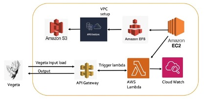
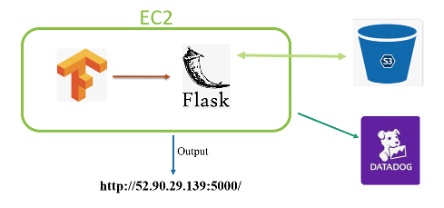

# Comparative Analysis of Neural Style Transfer Implementation on EC2 and Serverless Architecture in AWS

## Introduction

This project delves into cloud computing paradigms, notably Serverless computing and Infrastructure as a Service (IaaS) models, applied to Neural Style Transfer (NST). We explore the implementation of NST—a popular technique for image stylization—across AWS Lambda (Serverless) and EC2 (IaaS) to evaluate their performance and efficiency.

## Technologies Used

- AWS Lambda and EC2
- Python Flask
- TensorFlow
- AWS Elastic File System (EFS), API Gateway, S3 buckets, and Datasync

## Features

- Implementation of NST on both EC2 and Serverless architectures.
- Detailed analysis of performance and efficiency.
- Scalable and cost-effective solutions for complex image processing.

## Architecture Flow for Lambda

<!--  -->

<!--  -->

1. **State Configuration for Lambda:** Given that AWS Lambda is inherently stateless, establishing a state is crucial. We leverage AWS Elastic File System (EFS) to maintain state across executions.

2. **Mounting EFS and Deployment:** The model is deployed on EFS, which is mounted to an EC2 instance. TensorFlow and other dependencies are installed in the EFS's `lib` folder via target pip installation.

3. **Lambda Function Configuration:** A single Lambda function, configured with 3007 MB of RAM, sits behind an API Gateway layer. This function is invoked whenever the API Gateway triggers.

4. **Image Processing:** Upon invocation, the Lambda function retrieves an image from EFS, processes it through the NST model, and writes the output back to EFS.

5. **DataSync for Image Transfer:** AWS DataSync facilitates the transfer of images from the EFS destination folder to a corresponding S3 destination folder.

6. **Frontend Integration:** The destination folder in S3 is linked to our frontend website, allowing for the display and access of stylized images.

7. **Load Testing:** We employ the Vegeta load tester to conduct stress tests on the architecture, ensuring its robustness under high demand.

## Architecture Flow for EC2

<!--  -->

<!--  -->

1. **Creation of S3 Bucket:** An S3 bucket is set up through the AWS console, serving as the storage point for input and output images related to the Neural Style Transfer model. This bucket facilitates easy access and management of images needed for style transfer operations.

2. **EC2 Instance Setup:** We initiate an EC2 instance via the AWS console, installing essential software components such as Python, Flask, and the Neural Style Transfer model. This step prepares the computing environment for deploying and running our application.

3. **Flask App Development:** A Flask application is developed to interact with the S3 bucket. It retrieves input images, processes them through the Neural Style Transfer model, and saves the stylized images back into an output folder within the same S3 bucket. Additionally, this app is configured to send operational metrics to Datadog for monitoring purposes.

4. **Datadog Integration:** Datadog is integrated to monitor the Flask application, receiving metrics that help in setting up alerts and visualization dashboards. This step is crucial for maintaining the application's performance and availability, providing insights into its operation.

5. **Flask App Deployment:** The Flask app is deployed on the EC2 instance, with configurations set to utilize the S3 bucket for image storage and Datadog for monitoring. This deployment makes the application accessible and functional for processing Neural Style Transfer requests.

6. **Access to Flask App:** Users can access the Flask application through a web browser using the public IP address of the EC2 instance. This accessibility allows for the straightforward submission of images for stylization and the retrieval of processed outputs.

<!--  -->

## Conclusion

Our comparative analysis of EC2 and Serverless Architecture in AWS reveals distinct advantages in cloud computing's landscape. EC2 provides a high degree of control over computing resources, suited for long-term, intensive workloads with its scalable environment and on-demand pricing, facilitating cost optimization. Conversely, Serverless Architecture, highlighted by AWS Lambda, excels in handling sporadic, low-volume tasks with its automatic scaling and cost-effective model, eliminating the need for infrastructure management, thereby reducing costs and improving development agility.

In our project, statistical analysis demonstrated that serverless architectures could achieve more than 70% cost savings for intermittent workloads, significantly reducing expenses compared to traditional VM-based approaches. This efficiency, coupled with serverless computing's rapid deployment capabilities, underscores its value in accelerating project timelines.

Choosing between EC2 and Serverless Architecture in AWS isn't a one-size-fits-all scenario; it really comes down to what your application specifically needs. You've got to weigh your options carefully, considering how your workload fluctuates, what your budget looks like, and how much control over the computing environment you want to maintain. Our project peeled back the layers on these choices, shedding light on the economic and operational nuances of navigating the cloud computing world. It's about finding that sweet spot for your project, leveraging our insights to make an informed decision that aligns with your goals and resources.

## License

This project is licensed under the MIT License - see the LICENSE.md file for details.
